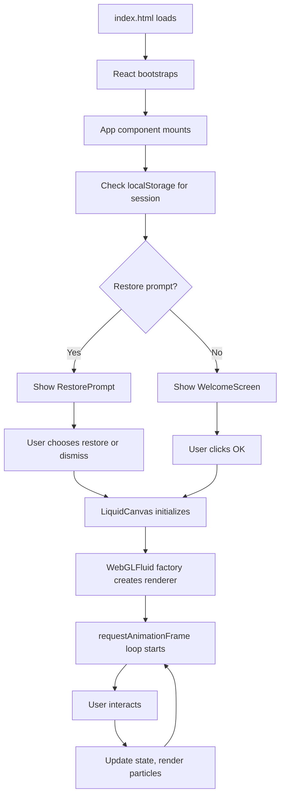
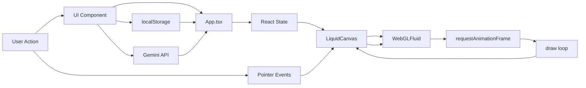

# Architecture

This document explains the rendering pipeline, application lifecycle, and data flow within the Psychedelic Liquid Light Show.

## Technology Stack

- **Language**: TypeScript (strict mode)
- **Framework**: React 19 with hooks
- **Build Tool**: Vite 6.2
- **Rendering**: Canvas2D (CanvasRenderingContext2D)
- **Styling**: Tailwind CSS (CDN)
- **AI**: Google Gemini 2.5 Flash SDK
- **Deployment**: AI Studio

### Why Canvas2D, Not WebGL?

This app prioritizes:
- **Simplicity**: Canvas2D is easier to reason about and debug
- **Compatibility**: Works on all modern browsers without WebGL context issues
- **Aesthetic**: Radial gradients and composite operations give a soft, organic look
- **Performance**: 1200 particles @ 60fps is achievable on mid-range devices

For WebGL implementations, see the [Roadmap](./roadmap.md).

---

## Application Lifecycle



---

## Rendering Pipeline

### Initialization (Mount)

1. **App.tsx mounts**:
   - Initializes state (`config`, `history`, `isPlaying`, etc.)
   - Sets up `useEffect` hooks for:
     - Session persistence (`beforeunload` listener)
     - Cursor generation (SVG data URL)
     - Artwork loading from localStorage

2. **LiquidCanvas mounts**:
   - Gets canvas element via `useRef`
   - Calls `WebGLFluid(canvas, config)` factory:
     - Gets 2D context
     - Sets up `ResizeObserver` for responsive sizing
     - Initializes particle array `[]`
     - Starts `requestAnimationFrame` loop
   - Registers pointer event listeners

3. **Initial render**:
   - Canvas is cleared to black
   - Demo mode starts (if `isDemoMode === true`)

### Frame Loop

```typescript
const draw = () => {
  // 1. Fade background (creates trails)
  ctx.fillStyle = 'rgba(0, 0, 0, 0.02)';
  ctx.fillRect(0, 0, canvas.width, canvas.height);
  
  // 2. Switch to blend mode
  ctx.globalCompositeOperation = config.blendMode;
  
  // 3. Update and render particles
  for (let i = particles.length - 1; i >= 0; i--) {
    const p = particles[i];
    
    // Update life
    p.life -= 0.5;
    if (p.life <= 0) {
      particles.splice(i, 1);
      continue;
    }
    
    // Update physics
    p.x += p.vx;
    p.y += p.vy;
    p.vx += (Math.random() - 0.5) * 0.4;  // jitter
    p.vy += (Math.random() - 0.5) * 0.4;
    p.vx *= 0.98;  // damping
    p.vy *= 0.98;
    p.radius *= 0.995;  // shrink
    
    // Draw with radial gradient
    const gradient = ctx.createRadialGradient(p.x, p.y, 0, p.x, p.y, p.radius);
    gradient.addColorStop(0, `rgba(r, g, b, ${alpha * 0.8})`);
    gradient.addColorStop(0.4, `rgba(r, g, b, ${alpha * 0.2})`);
    gradient.addColorStop(1, `rgba(r, g, b, 0)`);
    ctx.fillStyle = gradient;
    ctx.arc(p.x, p.y, p.radius, 0, 2 * Math.PI);
    ctx.fill();
  }
  
  // 4. Request next frame
  requestAnimationFrame(draw);
};
```

### Particle Lifecycle

1. **Spawn**: User clicks/drags → `splat(x, y)` → 5 particles created
2. **Birth**: Each particle gets:
   - Position: `x`, `y` (client coords × DPR)
   - Velocity: Random angle × speed (1–4 px/frame)
   - Radius: `canvasWidth * 0.05 * splatRadius` (scaled by config)
   - Color: Hex string from palette
   - Life: 350–600 frames (~5.8–10 seconds @ 60fps)
3. **Update**: Each frame:
   - Life decreases by 0.5
   - Position += velocity
   - Velocity += jitter (random ±0.4)
   - Velocity *= 0.98 (damping/friction)
   - Radius *= 0.995 (shrink)
4. **Render**: Draw radial gradient with alpha based on life
5. **Death**: When `life <= 0`, remove from array

### Particle Pooling

- Array capped at **1200 particles**
- When exceeded, oldest particles are removed (FIFO)
- No object pooling (relies on GC)

---

## Post-Processing

### SVG Filters (AfterEffects component)

#### Chromatic Aberration
Separates RGB channels and offsets them:
```xml
<filter id="chromatic-aberration">
  <feColorMatrix in="SourceGraphic" type="matrix" result="red" ... />
  <feOffset in="red" dx="-chromaticAberration * 20" dy="0" result="red-shifted" />
  <!-- repeat for green (no offset) and blue (positive offset) -->
  <feBlend in="red-shifted" in2="green-shifted" mode="screen" result="blend1" />
  <feBlend in="blend1" in2="blue-shifted" mode="screen" />
</filter>
```
Applied via CSS: `filter: url(#chromatic-aberration)`

#### Grain (Noise)
Fractal noise overlay via SVG data URL:
```html
<div style="background-image: url('data:image/svg+xml,...')" />
```
Uses `feTurbulence` filter with `baseFrequency="0.75"` and 3 octaves.

### Canvas Composite Operations

Controlled by `config.blendMode`:
- **lighter**: Additive blending (default; bright, glowy)
- **screen**: Similar to lighter but less intense
- **overlay**: Contrast-enhancing mix
- **soft-light**: Subtle lighting effect
- **multiply**: Darkening blend
- **difference**: Inverts overlapping colors (trippy!)

---

## Resize Handling

### Device Pixel Ratio (DPR)

Canvas resolution is scaled by `window.devicePixelRatio` (1x, 2x, 3x for Retina displays):

```typescript
const resizeCanvas = () => {
  const dpr = window.devicePixelRatio || 1;
  canvas.width = canvas.clientWidth * dpr;
  canvas.height = canvas.clientHeight * dpr;
};
```

- **ResizeObserver** watches canvas element size changes
- Triggers on mount, window resize, and element layout shifts
- Defers initial resize to avoid 0×0 canvas issues

### Memory Considerations

- High DPR can quadruple memory usage (2x → 4x pixels)
- Particles are positioned in scaled coordinates
- No framebuffer or texture memory (Canvas2D allocates internally)

---

## Input Handling

### Pointer Events

```typescript
const handlePointerDown = (e) => {
  isPointerDownRef.current = true;
  const rect = e.currentTarget.getBoundingClientRect();
  const x = e.clientX - rect.left;
  const y = e.clientY - rect.top;
  splat(x, y);
};

const handlePointerMove = (e) => {
  if (isPointerDownRef.current) {
    // same coordinate transform
    splat(x, y);
  }
};

const handlePointerUp = () => {
  isPointerDownRef.current = false;
  commitSnapshot();  // save for undo
};
```

- **No smoothing**: Direct 1:1 mapping of pointer to splats
- **Touch-friendly**: Pointer events unify mouse/touch/pen
- **Custom cursor**: SVG crosshair with active color fill

### Keyboard

- **ESC**: Closes modals, panels, sidebar
- **Enter**: Submits forms (save dialog, AI prompt input)

---

## State Management

### React State

Managed in `App.tsx`:
- `config`: `LiquidConfig` object (density, velocity, colors, etc.)
- `isPlaying`: Animation play/pause
- `activeColorIndex`: Which color in palette is selected
- `isGenerating`: Loading state for AI requests
- `savedArtworks`: Gallery entries from localStorage
- `toast`: Notification message
- `showRestorePrompt`: Session restore UI flag
- `isRecording`: Video recording status

### Refs (Non-reactive state)

- `history.current`: Array of past configs (30 max)
- `historyIndex.current`: Undo/redo position
- `getCanvasDataUrlRef.current`: Callback to capture canvas as JPEG
- `getCanvasStreamRef.current`: Callback to get `MediaStream` for recording
- `clearCanvasRef.current`: Callback to clear canvas
- `canvasUndoRef.current` / `canvasRedoRef.current`: Visual snapshot undo/redo

### localStorage

- `liquid-art-session`: Serialized session state (config, history, playback state)
- `liquid-art-prompt-restore`: Flag to show restore prompt on reload
- `liquid-art-gallery`: Array of saved artworks (name, config, thumbnail)
- `sidebar-pos`: Sidebar drag position (x, y)

---

## Data Flow Diagram



---

## Session Persistence

### Save on Exit

```typescript
window.addEventListener('beforeunload', () => {
  const state = {
    config,
    history: history.current,
    historyIndex: historyIndex.current,
    isPlaying,
    isGridVisible,
    activeColorIndex,
  };
  localStorage.setItem('liquid-art-session', JSON.stringify(state));
  localStorage.setItem('liquid-art-prompt-restore', 'true');
});
```

### Restore on Load

```typescript
useEffect(() => {
  const shouldPrompt = localStorage.getItem('liquid-art-prompt-restore') === 'true';
  const savedState = localStorage.getItem('liquid-art-session');
  if (shouldPrompt && savedState) {
    setShowRestorePrompt(true);
  }
}, []);
```

---

## Performance Characteristics

| Metric | Value | Notes |
|--------|-------|-------|
| Target FPS | 60 | Achieved on MacBook Pro 2019+ |
| Particle count | ~400–1200 | Varies by user activity |
| Particle lifetime | 350–600 frames | 5.8–10 seconds |
| Draw calls/frame | 1 clear + N particles | N = particle count |
| Memory usage | ~50MB | Includes React, DOM, canvas buffer |
| Startup time | <1s | React bootstrap + initial render |

---

## Next Steps

- Read [Components](./components.md) for UI implementation details
- See [Performance](./performance.md) for optimization techniques
- Check [Development](./development.md) for local setup
